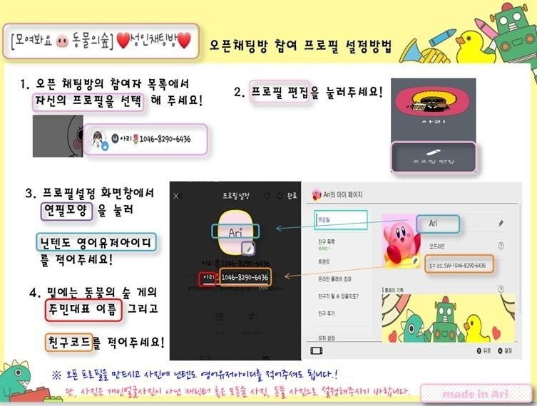
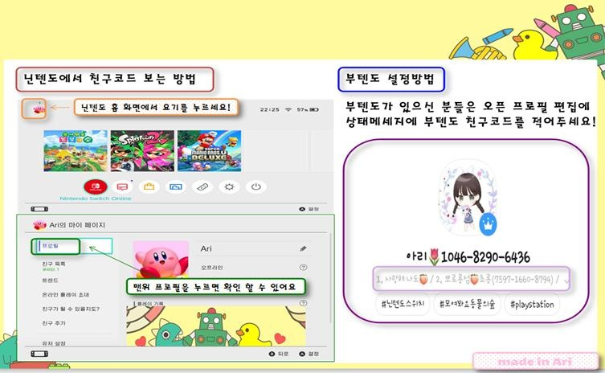
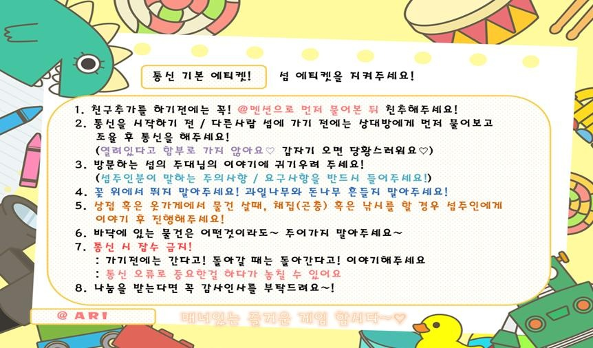

<html>
<head>
  <meta charset="utf-8">
</head>
<body>
  <h2>모여봐요 동물의 숲 성인방 프로필 설정하는 방법</h2>
  
  

  

  <ol>
    <li>닌텐도 계정의 닉네임</li>
    <li>주민대표 이름(동물의 숲 내에서의 닉네임)</li>
    <li>12자리 숫자의 친구코드</li>
  </ol>

   닌텐도 계정의 닉네임은 프로필 사진에 적습니다.
   (닉네임이 들어간 프로필 사진이라면 모두 가능합니다.)
    캐릭터를 지우면 글자를 더 많이 입력할 수 있습니다.
  
  
프로필 이름에는 (주민대표)/(친구코드)형식을 기재합니다.

  
다음은 톡방 내 에티켓에 관련한 공지입니다.

  

</body>
</html>
